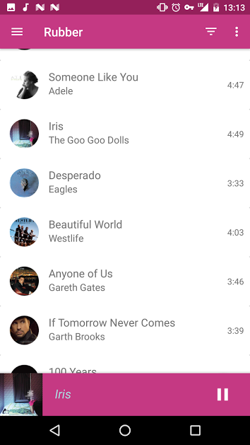

# Rubber

Rubber is a simple music player that fix personal requirement as well as AOSP

# Feature

* material design
* song's fact behind music
* MVP with RxJava

# Screenshot
  

# External libraries used 

* [CircularImageView](https://github.com/lopspower/CircularImageView)
* [butterknife](https://github.com/JakeWharton/butterknife)
* [picasso](https://github.com/square/picasso)
* [jsoup](https://github.com/jhy/jsoup)
* [RxJava](https://github.com/ReactiveX/RxJava)

